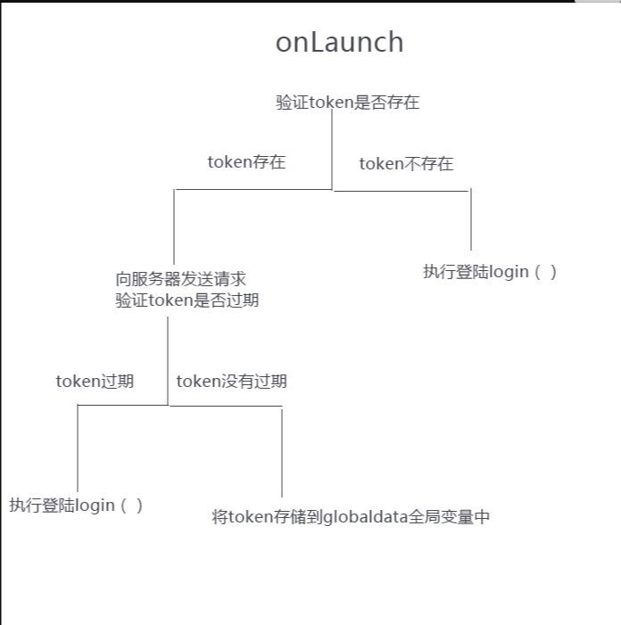

# 微信小程序登录流程

## (1)获取 code

用户通过 login()方法获取 code,然后把 code 传递给开发后台,后台通过 code 以及 appid 以及密钥获取 openid 和 sessionkey 进行登录,然后返回一个 token 给前端

> 注意获取 openid 和 sessionkey 不要在前端执行,都要有后端来处理,我们只需要传 code 就行

## (2) 前端拿到 token 之后存储

- 前端拿到 token 之后存储在 globalData 变量中,这样其他页面就可以通过

```javascript
var app = getApp();
console.log(app.globalData); //调用token
```

- 但是全局变量会随着小程序关闭,就会清除变量。所以我们要将 token 存在到缓存中

> 设置缓存两种方式 setStorageSync 是同步存储,将 token 存储后才执行后面的代码,setStorage 是异步存储 wx.setStorageSAync(token,token); wx.setStorage({key:'key',data:data})

- 在 onLaunch 中 token 的具体流程


