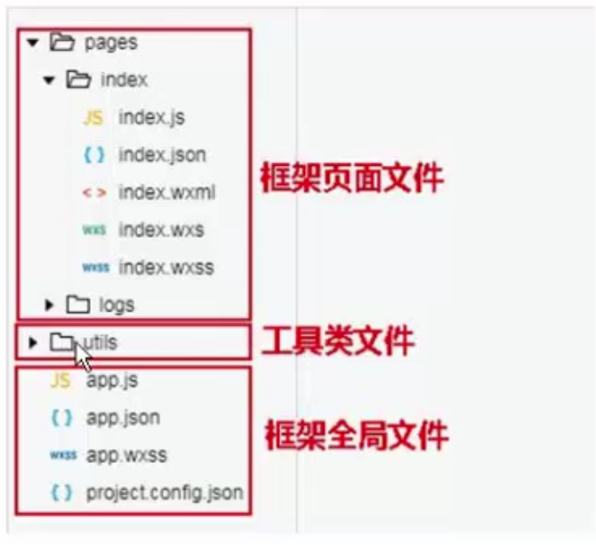

# 微信小程序目录介绍

## 三大类

- 框架页面文件

- 工具类文件

- 框架全局文件



## 框架页面文件

> 主要就是页面里面的文件,它分成 4 个部分

- xxxx.wxml 类似 html 文件只负责渲染数据

- xxxx.wxss 类似 css 只负责样式文件

- xxxx.json 类似配置文件。比如修改头部标题或者颜色之类的

- xxxx.js (非常重要)一般钩子函数,逻辑问题都在这里写

## 工具类文件

> 主要就是类似工具类，比如格式化，时间戳之类的

## 框架全局文件

- app.js (入口文件,定义全局变量之类的)

- app.json (配置文件,比如页面,头部,tabbar)

- app.wxss (全局样式文件)

- project.config.json (项目配置文件,一般不用管)

- sitemap.json (规则文件,一般也不用管)

## app.json

- 总览

```javascript
{
  "pages":[
    "pages/text/text",
    "pages/index/index",
    "pages/logs/logs"
  ],
  "window":{
    "backgroundTextStyle":"light",
    "navigationBarBackgroundColor": "#fff",
    "navigationBarTitleText": "Weixin",
    "navigationBarTextStyle":"black"
  },
  "tabBar": {
    "color": "#666666",
    "selectedColor": "#ff4a4a",
    "borderStyle": "white",
    "backgroundColor": "#ffffff",
    "list": [{
      "pagePath": "pages/index/index",
      "text": "首页",
      "iconPath": "img/home.png",
      "selectedIconPath": "img/home_slt.png"
    },{
      "pagePath": "pages/fans/fans",
      "text": "粉丝",
      "iconPath": "img/fans_merchant.png",
      "selectedIconPath": "img/fans_merchant_slt.png"
    },{
      "pagePath": "pages/shopCart/shopCart",
      "text": "购物车",
      "iconPath": "img/shopping_cart.png",
      "selectedIconPath": "img/shopping_cart_slt.png"
    },{
      "pagePath": "pages/mine/mine",
      "text": "我的",
      "iconPath": "img/mine.png",
      "selectedIconPath": "img/mine_slt.png"
    }]
  },
  "debug":true,
  "networkTimeout":{
    "request":3000,
    "downloadFile":3000
  }
  "style": "v2",
  "sitemapLocation": "sitemap.json"
}

```

### debug

- 要是设置为 true,则有利于调试，但上架前必须关闭

### newworkTimeout 网络超时报错

- request: 发送请求超过 3s 报错

- downloadFile: 下载时间超过 3S 报错

### pages

- 数组里面每一个记录对应一个页面

- 谁放在上面,模拟器优先显示哪个

```javascript
 "pages":[
    "pages/text/text",
    "pages/index/index",
    "pages/logs/logs"
  ]
```

### tabbar

- 底部导航只有底部导航这几个页面有 tabbar 其他页面没有(最大只能 5 个)

- 底部 icon 图片大小支持 81px-81px,但是最佳尺寸是 60px-60px,两边留有 10px 留白

- selectedIconPath 表示选中图标

- iconPath 表示默认图标

```javascript
  "tabBar": {
    "color": "#666666",
    "selectedColor": "#ff4a4a",
    "borderStyle": "white",
    "backgroundColor": "#ffffff",
    "list": [{
      "pagePath": "pages/index/index",
      "text": "首页",
      "iconPath": "img/home.png",
      "selectedIconPath": "img/home_slt.png"
    },{
      "pagePath": "pages/fans/fans",
      "text": "粉丝",
      "iconPath": "img/fans_merchant.png",
      "selectedIconPath": "img/fans_merchant_slt.png"
    },{
      "pagePath": "pages/shopCart/shopCart",
      "text": "购物车",
      "iconPath": "img/shopping_cart.png",
      "selectedIconPath": "img/shopping_cart_slt.png"
    },{
      "pagePath": "pages/mine/mine",
      "text": "我的",
      "iconPath": "img/mine.png",
      "selectedIconPath": "img/mine_slt.png"
    }]
  },
```

### window

- 文字功能

```javascript
  "window":{
    "backgroundTextStyle":"light", //下拉loading样式仅支持dark/light
    "navigationBarBackgroundColor": "#fff", //导航栏背景颜色仅支持十六进制
    "navigationBarTitleText": "Weixin", //导航栏文字
    "navigationBarTextStyle":"black" //导航栏标题颜色 仅支持balck/white
  },
```

## app.js

- globalData 全局使用

```javascript
  globalData: {
    userInfo: null,
    testdata:{
      id:1,
      message:"全局测试"
    }
  }
```

- 页面里面使用的时候

`必须调用getApp()方法`

> 千万注意的就是 globalData ,D 必须大写

```javascript
const app = getApp();
  data: {
    message: "这就是测试页面",
    globaldatamessage:app.globalData.testdata.message
  },
```

## app.wxss

```bash
全局的样式文件,用来初始化
```
