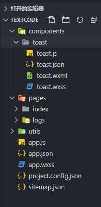

# 小程序自定义组件

> 在写小程序的时候,有的时候页面的内容过多,逻辑比较复杂。如果全都写在一个页面的话,会比较繁琐。代码可读性差,也不利于后期维护。这个时候必须要用到组件。逻辑抽象出来。它也有 wxml,wxss,和 js 文件。

## 自定义组件的建立和引用

### 1.创建目录和代码

- 在网站的根目录创建一个 component 文件夹

- 然后在 component 文件夹下面创建一个文件夹 toast

- 接着鼠标右键这个文件夹选择新建 component,会出现 4 个文件,如图所示



- toast.wxml 代码

```html
<view class="toast_content_box">
  <view class="toast_content">
    <view class="toast_content_text"> {{innerText}} </view>
  </view>
</view>
```

- toasr.wxss

```css
/*toast*/
.toast_content_box {
  display: flex;
  width: 100%;
  height: 100%;
  justify-content: center;
  align-items: center;
  position: fixed;
  z-index: 999;
  top: 0;
}
.toast_content {
  padding: 20rpx 40rpx;
  background: rgba(0, 0, 0, 0.8);
  border-radius: 20rpx;
}
.toast_content_text {
  height: 100%;
  width: 100%;
  color: #fff;
  font-size: 28rpx;
  text-align: center;
}
```

- toast.json 代码

```javascript
{
  "component": true
}
```

- toast.js 代码

```javascript
// components/toast/toast.js
Component({
  /**
   * 组件的属性列表
   */
  properties: {
    // 这里定义了innerText属性，属性值可以在组件使用时指定
    innerText: {
      type: String,
      value: 'default value',
    },
  },

  /**
   * 组件的初始数据
   */
  data: {
    dataText: '',
    isShow: false,
  },

  /**
   * 组件的方法列表
   */
  methods: {
    //隐藏弹框
    hideDialog() {
      this.setData({
        isShow: !this.data.isShow,
      });
    },
    //展示弹框
    showDialog(data) {
      this.setData({
        isShow: !this.data.isShow,
        dataText: data,
      });
      var _this = this;
      // 定时器关闭
      setTimeout(function () {
        _this.hideDialog();
      }, 1000);
    },
  },
});
```

### 2. 使用自定义组件

- 必须要在使用前声明,比如 index 页面使用 找到 index.json 文件

- 路径要匹配对

```javascript
{
  "usingComponents": {
    "toast":"../../components/toast/toast"
  }
}
```

### 3.在 index.wxml 里面使用自定义组件

- 节点名就是自定义组件的标签名,节点属性

```html
<toast id="toastDialog" innerText="我看看"></toast>
若是相传变量也可以
<toast id="toastDialog" innerText="{{dataall}}"></toast>
```

> 父组件向子组件传值以属性的方式，子组件以 properties 接收,并可指定数据类型 type 以及默认值 value,在 wxml 里可直接{{name}}使用,在 js 中可以 this.properties.name 获取

## 子组件向父组件传值

- child.js

```javascript
methods: {
  changeName() {
    this.triggerEvent('changeName', {
      name: '李四'
    })
  }
}
```

- parent.wxml

```javascript
<my-component
  name="{{name}}"
  age="{{age}}"
  bindchangeName="changeName"
></my-component>
```

- parent.js

```javascript
changeName(event) {
  console.log(event.detail)
  // { name: '李四' }
}
```

> 子组件向父组件传递数据使用 this.triggerEvent 方法,接受 3 个参数 1.方法名 2.组件外的数据 3.是否冒泡(可以不传,默认就是 false)
